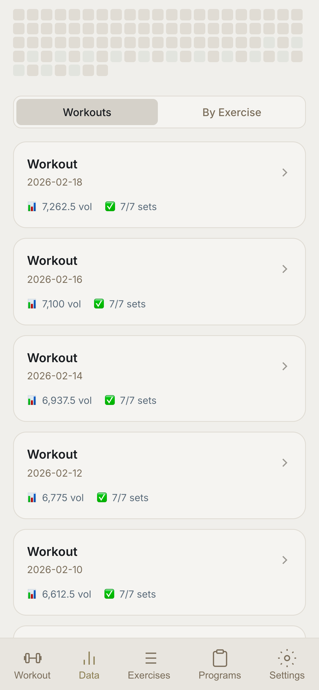

# LibreLift

A libre, open-source lifting app — track workouts, progressive overload, and more.

Built with **Vite + vanilla JS + IndexedDB**. No frameworks, no lock-in.

[Buy me a coffee ☕️](https://ko-fi.com/longestmt)

<p align="center">
  
  &nbsp;&nbsp;&nbsp;&nbsp;
  
</p>

## Features

- **Workout Logging** — weight, reps, RPE per set with tap-to-complete
- **Progressive Overload** — auto-suggests next weight based on history, deloads after failures
- **Plate Calculator** — visual barbell with your plate inventory
- **Rest Timer** — SVG countdown with vibration + sound
- **Exercise Library** — 59 exercises with instructions and video links
- **Workout Plans** — StrongLifts 5×5, Ivysaur 4-4-8, Reddit PPL + custom builder
- **History** — 90-day heatmap, workout list, exercise progression charts
- **Data Backup** — JSON export/import
- **Themes** — Compline (dark) / Lauds (light)
- **PWA** — installable, works offline
- **Sync-Ready** — UUID + timestamps + soft-delete on every record

## Quick Start

```bash
npm install
npm run dev
```

## Tech Stack

| Layer | Choice |
|-------|--------|
| Build | Vite |
| Language | Vanilla JS (ES modules) |
| Storage | IndexedDB |
| PWA | vite-plugin-pwa + Workbox |
| Styling | CSS custom properties |

## Theme

Dark theme (**Compline**) and light theme (**Lauds**) inspired by [joshuablais/compline](https://github.com/joshuablais/compline).

## License

[AGPL-3.0-or-later](LICENSE)
