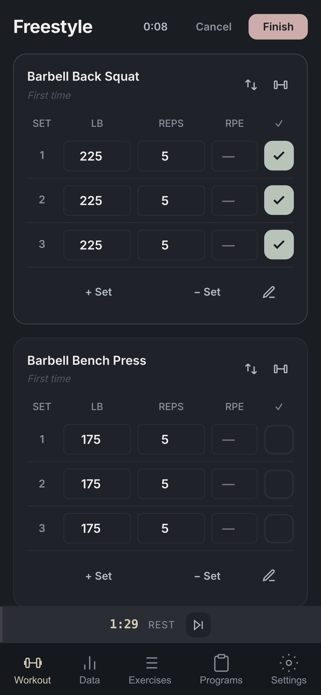
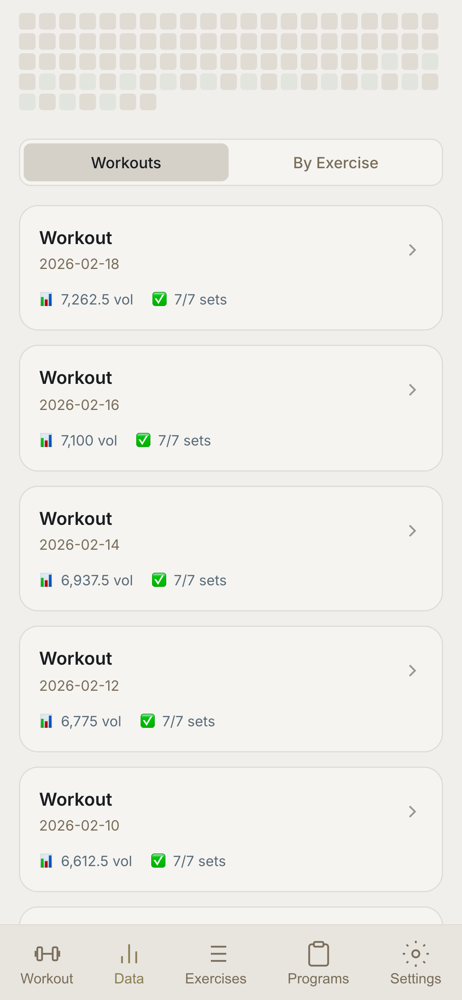

# LibreLift

A libre, open-source lifting app — track workouts, progressive overload, and more.

Built with **Vite + vanilla JS + IndexedDB**. No frameworks, no lock-in.

[Buy me a coffee ☕️](https://ko-fi.com/longestmt)

<p align="center">
  
  &nbsp;&nbsp;&nbsp;&nbsp;
  
</p>

## Features

- **Workout Logging** — weight, reps, RPE per set with tap-to-complete
- **Progressive Overload** — auto-suggests next weight based on history, deloads after failures
- **Plate Calculator** — visual barbell with your plate inventory
- **Rest Timer** — SVG countdown with vibration + sound
- **Exercise Library** — 59 exercises with instructions and video links
- **Workout Plans** — StrongLifts 5×5, Ivysaur 4-4-8, Reddit PPL + custom builder
- **History** — 90-day heatmap, workout list, exercise progression charts
- **Data Backup** — JSON export/import
- **Themes** — Compline (dark) / Lauds (light)
- **PWA** — installable, works offline
- **Encrypted LibreSync** — optional offline-first multi-device synchronization through a self-hosted relay

## LibreSync

LibreSync is optional and remains separate from JSON, Gist, and WebDAV backups.
Configure it under **Settings → LibreSync**. A new vault needs explicit remote
storage consent, a LibreSync HTTPS URL, and a device label. An authorized device
can create a short-lived, single-use pairing payload for another device. There
is no recovery phrase in this version, so keep at least one authorized device
or a current portable backup.

Joining with existing local records and every full replacement restore first
writes a safety JSON file and verifies its exact bytes by reading the selected
file back. Browsers without a native save-file API download the file and ask
you to select that same file before the operation can continue.

Synchronized data:

- exercises, plans, completed workouts, workout sets, and body-weight records;
- unit, bar weight, rest timer, auto-pause threshold, maximum workout duration,
  distance unit, plate inventory, and theme.

Device-local data:

- the active workout draft/session and last-used plan;
- seed and migration flags;
- Gist and WebDAV credentials and backup metadata;
- LibreSync vault keys, device credentials, cursor, inbox, outbox, quarantine,
  and conflict state.

An in-progress workout cannot be handed to another device. Local writes remain
available while the relay is unreachable and synchronize after reconnect, while
the app is open. Browser key storage is protected only by this browser profile
and origin. End-to-end encryption protects relay storage; it does not protect a
compromised device, browser profile, app, or authorized malicious replica.

Conflict review retains every concurrent alternative and lets the user keep one
or enter an intentional merged value. A live update remains visible beside a
concurrent deletion until the conflict is resolved. Device revocation blocks
future relay access but cannot erase data or a vault key already downloaded by
that device. Explicit disconnect keeps app data but removes the local relay
credential; pairing again registers a fresh device identity, while the old
server device entry remains available for revocation by an authorized device.

## Quick Start

```bash
npm install
npm run dev
```

For local LibreSync package validation, build and pack the sibling `libresync`
workspace first, then install its generated tarballs. LibreLift never relies on
global `npm link` state.

## Tech Stack

| Layer | Choice |
|-------|--------|
| Build | Vite |
| Language | Vanilla JS (ES modules) |
| Storage | IndexedDB |
| PWA | vite-plugin-pwa + Workbox |
| Styling | CSS custom properties |

## Theme

Dark theme (**Compline**) and light theme (**Lauds**) inspired by [joshuablais/compline](https://github.com/joshuablais/compline).

## License

[AGPL-3.0-or-later](LICENSE)
